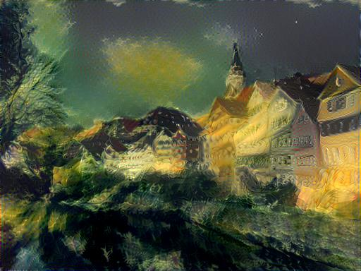
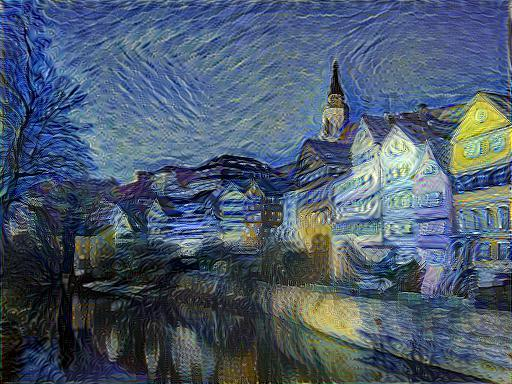
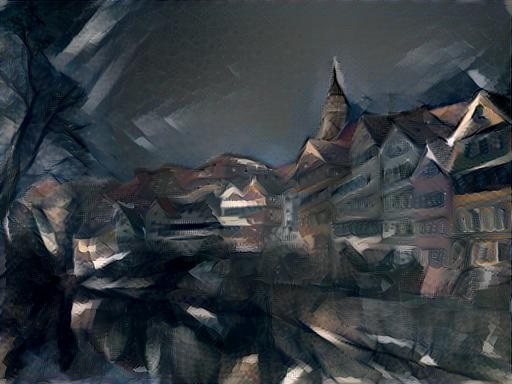
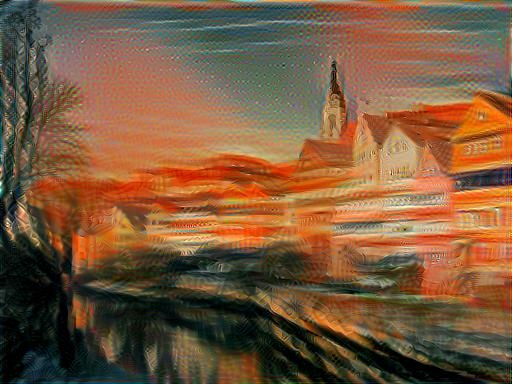
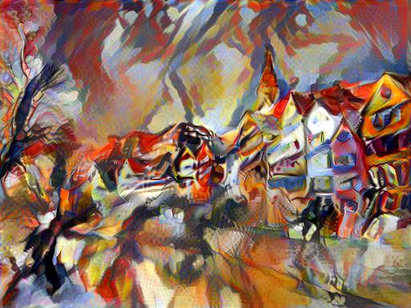

# ECBME4040 Class Project for Neural Network and Deep Learning, Fall 2017.

A tensorflow implementation of style transfer described in the papers

* [A Neural Algorithm of Artistic Style](https://arxiv.org/pdf/1508.06576v2.pdf)

## Usage

### Prerequisites
1. Tensorflow
2. Python packages : numpy, scipy, PIL, matplotlib
3. Pretrained VGG19 file : [imagenet-vgg-verydeep-19.mat](http://www.vlfeat.org/matconvnet/models/imagenet-vgg-verydeep-19.mat)

* Please download the pre-trained VGG19 model from link above.  
* Save the file under `nn_model`

### Running
Follow the steps in 
```
final_style_transfer.ipynb
```

## Sample results
### The Neckarfront in Tübingen, Germany
Results were obtained from default setting.  












## Saved model

The final model is stored under `saved_model`
